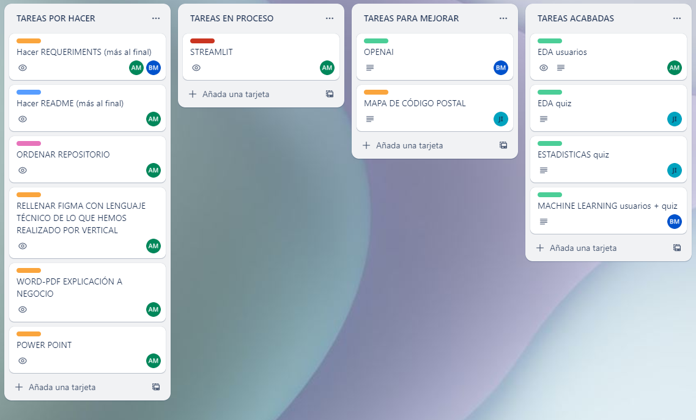
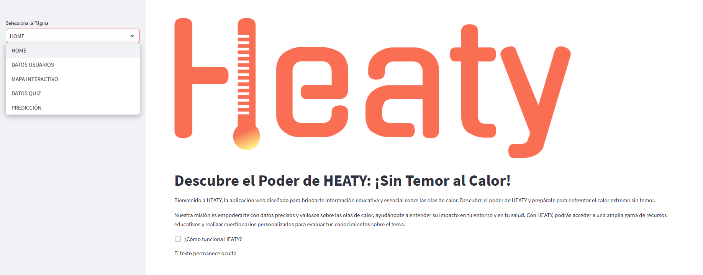
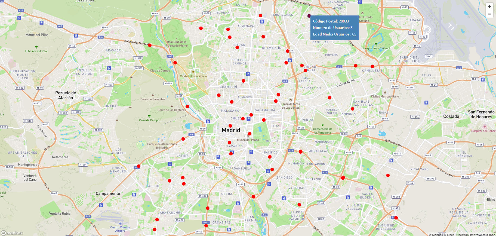
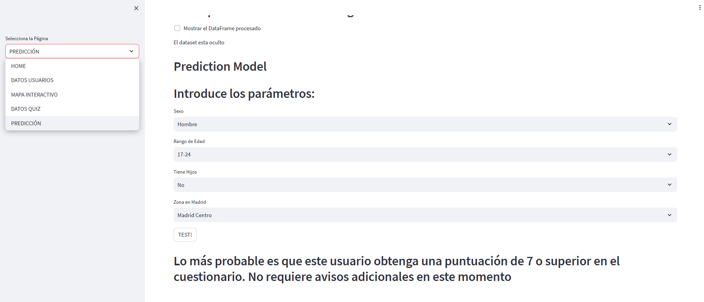

</a>
<h1>HEATLY: ¡Sin Temor al Calor!</h1>

#### Autores: [Alex Marzá Manuel](https://github.com/AlexCapis), [Blanca Marmolejo](https://github.com/BlancaMarmolejo),  [Juan A-Mendizábal Ibarrola](https://github.com/juanmendiz)

#### Contribuidores: [Daniel](https://github.com/danieskka),  [Diego](https://github.com/Banbushka)

</a>
<h1>ÍNDICE</h1>

[1. Introducción](#1-introducción)

[2. Desarrollo](#2-desarrollo)

[3. Distribucion de las carpetas](#3-distribución)

[4. Integración Mar-IA](#4-integración-mar-ia)

[5. Implementación del Mapa Interactivo](#5-implementación-del-mapa-interactivo)

[6. Aplicación Web con Streamlit](#6-aplicación-web-con-streamlit)

[7. Ideas y contribuiciones externas](#7-ideas-y-contribuiciones-externas)

# 1. Introducción

#### Descripción del proyecto

Bienvenido a HEATLY, la aplicación web diseñada para brindarte información educativa y esencial sobre las olas de calor. Descubre el poder de HEATLY y prepárate para enfrentar el calor extremo sin temor.

Nuestra misión es empoderarte con datos precisos y valiosos sobre las olas de calor, ayudándote a entender su impacto en tu entorno y en tu salud. Con HEATLY, podrás acceder a una amplia gama de recursos educativos y realizar cuestionarios personalizados para evaluar tus conocimientos sobre el tema.

¿Cómo funciona HEATY?

    
Información Educativa: Descubre el poder de HEATY y adquiere conocimientos sobre las olas de calor. Aprende sobre sus causas, consecuencias y medidas de prevención. Con esta información, estarás preparado para enfrentar el calor sin miedo.

Cuestionarios Personalizados: ¿Cuánto sabes realmente sobre las olas de calor? Con nuestros cuestionarios interactivos, podrás evaluar tus conocimientos y obtener retroalimentación para mejorar tu comprensión del tema. ¡Conviértete en un experto en el calor!

Pronóstico de Temperaturas: Descubre el poder de HEATY para mantenerte informado sobre las temperaturas venideras en tu área. Con esta anticipación, podrás planificar tus actividades y tomar las medidas necesarias para evitar el impacto del calor extremo.

Consejos Prácticos: Además de la información educativa, descubre el poder de HEATY para recibir consejos prácticos y recomendaciones para mantenerte fresco y seguro durante las olas de calor. ¡Sin temor al calor, estarás preparado!

En HEATY, creemos que estar informado y preparado es la clave para enfrentar el calor de manera segura y responsable. Descubre el poder de HEATLY y únete a nuestra comunidad de personas que enfrentan el calor sin temor.

¡Explora HEATY y descubre cómo puedes convertirte en un defensor de tu bienestar en tiempos de altas temperaturas! Tu seguridad y comodidad son nuestra prioridad, y estamos aquí para acompañarte en cada paso del camino.
    

# 2. Desarrollo

#### ¿Qué dificultades podemos encontrar?

- **Creación de bases de datos**: Dado que no había usuarios reales al iniciar el desarrollo de la aplicación, decidimos generar datos ficticios utilizando la librería "Faker" para demostrar qué análisis se podría proporcionar.
    

    
Solución con Faker

    

    import pandas as pd

    import random

    from faker import Faker

    from datetime import datetime, timedelta

    def generate_unique_database(num_rows):

        fake = Faker()
        database = set()
        email_set = set()
        user_id_set = set()

        start_date = datetime(2023, 1, 1)
        end_date = datetime.now()

        while len(database) < num_rows:
            fecha = fake.date_of_birth(minimum_age=18, maximum_age=100).strftime("%d-%m-%Y")
            nombre = fake.name()
            cp = random.choice(VALID_POSTAL_CODES)
            
            n_hijos_menores = random.randint(0, 5)
            sexo = random.choice(["M", "H"])

            while True:
                email = fake.email()
                if email not in email_set:
                    email_set.add(email)
                    break

            while True:
                user_id = random.randint(100000, 999999)
                if user_id not in user_id_set:
                    user_id_set.add(user_id)
                    break
            
            registration_date = fake.date_between(start_date=start_date, end_date=end_date).strftime("%d-%m-%Y")
            
            row = (registration_date, nombre, user_id, sexo, fecha, cp, n_hijos_menores, email)
            database.add(row)

        return list(database)
    

    

- **Desbalanceo de los datos**: Otro problema que podría surgir con el tiempo es que nuestro objetivo para el modelo podría desequilibrarse a medida que tomamos más datos. Para ello decidimos Implementar técnicas de equilibrado como parte del proceso automatizado de reentrenamiento.

    

    
Uso de SMOTE como solución

    

    #### Instantiate SMOTE
    smote = SMOTE(sampling_strategy='auto', random_state=42)

    #### Fit and apply SMOTE to balance the target column in 'mldf'
    X_resampled, y_resampled = smote.fit_resample(X_mldf, y_mldf)

    #### Create a new DataFrame 'data' with the balanced data
    data = pd.DataFrame(X_resampled, columns=X_mldf.columns)
    data['target'] = y_resampled

    #### Check the balance of the 'target' column in the balanced DataFrame 'data'
    target_counts_balanced = data['target'].value_counts()

    

    

- **Gran equipo de trabajo**: Al inicio, trabajar en un equipo de 15 personas fue un tanto desconcertante, pero rápidamente encontramos la clave para el éxito: mantener una comunicación constante dentro del equipo de datos y con los otros equipos involucrados en este desafío grupal. Nuestro equipo de data science colaboraba estrechamente con equipos de marketing, UXUI, ciberseguridad, nube y desarrollo completo. La excelente comunicación entre todos nosotros fue el factor fundamental que hizo que nuestro trabajo fuera altamente eficiente. 

    

    
Discord y Google Meet

    

    Nuestra comunicación efectiva se logró gracias al uso de dos aplicaciones clave. Utilizamos Google Meet para realizar nuestras reuniones diarias, lo que nos permitió mantenernos sincronizados y actualizados sobre el progreso del proyecto. Además, contamos con Discord para comunicaciones más ágiles y para resolver problemas cotidianos de forma rápida y eficiente. Estas herramientas nos brindaron una excelente plataforma para colaborar de manera efectiva y mantener una estrecha relación entre los equipos, facilitando así nuestro trabajo conjunto en el desafío grupal.
    

    

    

    
Trello y Figma

    Para lograr una organización rápida y eficaz en nuestro amplio equipo, empleamos las aplicaciones Trello y Figma. Utilizamos Trello para distribuir tareas dentro del grupo de data science, lo que nos permitió mantener un seguimiento claro y ordenado de las actividades en curso. Por otro lado, Figma fue la herramienta elegida para una distribución más global de todos los equipos, permitiéndonos observar cómo se desarrollaban los diferentes equipos que formaban parte de cada vertical. Estas aplicaciones fueron fundamentales para mantener la coordinación y visibilidad necesarias en nuestro proyecto grupal.

    

    

- **Interpretación de resultados**: Comprender y comunicar los resultados del modelo de manera efectiva puede ser un desafío. Se necesita interpretar los hallazgos y explicar las predicciones de forma comprensible para diferentes audiencias. Por ello, desde el equipo de data science realizamos un Streamlit para que la comprensión de los datos y la comunicación hacia el equipo de negocio fuera más eficiente y directa.
    

    
Streamlit

    

    

# 3. Estructura de carpetas

A continuación se detallan las carpetas y los requisitos de cada una:

1. [app](https://github.com/AlexCapis/DESAFIO/tree/main/app): Contiene los datos necesarios para desplegar streamlit y que se pueda conectar con el equipo de Cloud y Full-Stack. Esta carpeta está compuesta por lo siguiente:
   - `data`: Contiene los datos en csv obtenidos de los distintos notebooks.
        - `processed`: Almacena los datos procesados después de realizar todas las transformaciones necesarias.
        - `quiz`: Contiene los datos de los usuarios que han realizado el cuestionario.
        - `table_cp`: Almacena los datos de las coordenadas de los códigos postales de los usuarios.
        - `users_login`: Engloba los datos pertenecientes a todos los usuarios que se han registrado en la aplicación web.
   - `images`: Almacena los datos procesados después de realizar todas las transformaciones necesarias.
        - `eda_quiz`: Almacena las imágenes obtenidas a partir del análisis exploratorio de los datos de 'quiz'
        - `eda_users`: Contiene las imágenes obtenidas a partir del análisis exploratorio de los datos de 'users_login'
        - `heatlylogo.jpg`: El logo emblemático de la aplicación web
   - `models`: Contiene los datos del modelo ganador de las predicciones de machine learning realizadas en el notebook 'des_pred_machine_learning.ipynb'.
   - `requirements.txt`: Almacena los datos necesarios para poder desplegar el docker con el equipo de Cloud y generar una url funcional.
   - `visualizacion_negocio.py`: Contiene el streamlit con todas las funcionalidades.

2. [data](https://github.com/AlexCapis/DESAFIO/tree/main/data): Contiene los datos utilizados en el proyecto. Se compone de las siguientes subcarpetas:
   - `maps`: Contiene los datos en html para que funcione el mapa de los usuarios con respecto al código postal.
   - `processed`: Almacena los datos procesados después de realizar todas las transformaciones necesarias del notebook de 'eda_users.ipynb'.
   - `quiz`: Contiene los datos de los usuarios que han realizado el cuestionario.
   - `table_cp`: Almacena los datos de las coordenadas de los códigos postales de los usuarios.
   - `users_login`: Engloba los datos pertenecientes a todos los usuarios que se han registrado en la aplicación web.

3. [docs](https://github.com/AlexCapis/DESAFIO/tree/main/docs): En dicha carpeta se mostrarán los documentos complementarios, los cuales se componen de la siguiente manera:

   - `images`: Se plasma el código para la aplicación web que utiliza el modelo entrenado (Streamlit,...).
         - `eda_quiz`: Contiene los gráficos que se crean del notebook de 'eda_quiz.ipynb'.
         - `eda_users`: Contiene los gráficos que se crean del notebook de 'eda_users.ipynb'.
         - `streamlit`: Almacena la imagen para ver como nos hemos organizado el trabajo desde el equipo de data science.
         - `streamlit`: Almacena imágenes del streamlit que hemos realizado para comunicarnos con el equipo de negocio.
         - `heatylogo.jpg`: Es el logo de nuestra aplicación web.
   - `equipo_data_science.pdf`: Plasma el contenido del trabajo realizado por el equipo de data science de forma más detallada
   - `equipo_data_science.pptx`: Es un power point que indica aquello que hemos realizado de forma esquemática y lo que queremos implementar en el futuro.

4. [models](https://github.com/AlexCapis/DESAFIO/tree/main/models): 
   - `trained_model.pkl`: Contiene los datos del modelo ganador de las predicciones de machine learning realizadas en el notebook 'des_pred_machine_learning.ipynb'.

5. [notebooks](https://github.com/AlexCapis/DESAFIO/tree/main/notebooks): Se encuentran los archivos Jupyter Notebook que contienen los distintos desarrollos del proyecto. Estan estructurados de la siguiente manera.
   - `db_creation_csv.ipynb`: Se desarrollan con detenimiento las bases de datos de usuarios y de cuestionario de forma detallada.
   - `eda_quiz.ipynb`:  Contiene el análisis exploratorio de datos del cuestionario realizado por los usuarios.
   - `eda_users.ipynb`:  Contiene el análisis exploratorio de datos de los usuarios.
   - `heatwaveAI.ipynb`: Almacena la información más detallada acerca de la implementación del Chatbot.
   - `machine_learning.ipynb`: Engloba el desarrollo del machine learning realizado originando el modelo ganador.

6. [openAI](https://github.com/AlexCapis/DESAFIO/tree/main/openAI): 
   - `templates`: Almacena el código de html necesario y los 'assets' pertinentes para poder mejorar visualmente el código de 'app.py'
   - `app.py`: Muestra el código necesario para desplegar el Chatbot con respuestas personalizadas.
   - `requeriments`: Almacena los datos necesarios para poder desplegar el docker con el equipo de Cloud y generar una url funcional.

# 4. Integración Mar-IA

Construimos un Chatbot llamado Mar-IA impulsado por IA que interactúa con los usuarios y brinda respuestas personalizadas y oportunas a sus preguntas. El Chatbot mejora la experiencia del usuario al proporcionar asistencia inmediata y precisa, además de aliviar la carga del equipo de soporte al manejar consultas comunes de manera automatizada.
    

    
Mar_IA

    
    

# 5. Implementación del Mapa Interactivo

Implementamos un mapa interactivo que muestra la ubicación geográfica de los usuarios utilizando los códigos postales. En dicho mapa se podrá observar el sumatorio de los usuarios que pertenecen a ese código postal, además se proporcionará la edad media pertinente de dichos usuarios. Esta funcionalidad proporciona una visión geográfica de la distribución de los usuarios, lo que ayuda al equipo de negocio a comprender mejor la audiencia y planificar estrategias de marketing y expansión.
    

    
Mapa Interactivo 

    
    

# 6. Aplicación Web con Streamlit

Desarrollamos una aplicación web utilizando Streamlit, una biblioteca de Python, que permite al equipo de negocio acceder a estadísticas de manera directa y actualizada. La interfaz de Streamlit es fácil de usar y brinda una visualización clara de los datos, lo que facilita la interpretación y toma de decisiones basadas en datos en tiempo real. En el streamlit podremos ver los datos estadísticos de los usuarios y del cuestionario. Además, se ha implementado el mapa interactivo de los usuarios y la predicción de machine learning en el cual, de manera interactiva se puede predecir si un usuario va a suspender el cuestionario (nota menor que 7) o si un usuario va a aprobarlo (nota mayor que 7) solamente es necesario que se introduzcan los parámetros necesarios que se le piden al usuario al registrarse en la aplicación web.

- **Datos usuarios**: En la aplicación, el equipo de negocio puede acceder a datos demográficos, comportamiento del usuario y patrones de uso, lo que les permite entender mejor a su audiencia y ajustar sus estrategias en consecuencia.
    

    
Estadísticas

    
    

- **Mapa Interactivo**: Insertamos dentro de Streamlit el mapa interactivo de los usuarios para que desde negocio puedan tener toda la información detallada desde el mismo sitio web, de esta manera se trabaja con mayor rapidez y dinamismo.

- **Datos quiz**: La aplicación también muestra datos relevantes relacionados con el cuestionario, como el rendimiento promedio, las respuestas más comunes y otros indicadores clave que ayudan a evaluar la efectividad y el impacto del cuestionario en los usuarios.
    

    
Estadísticas

    
    

- **Predicciones**: Esta función proporciona una herramienta poderosa para el equipo de negocio, ya que les permite anticiparse a las necesidades y comportamientos de los usuarios. Con esta información, pueden personalizar la experiencia de los usuarios, brindar recomendaciones específicas y tomar decisiones más informadas para mejorar la retención y satisfacción del usuario.
    

    
¿Cómo funciona?

    

    Cuando un usuario se registra en la aplicación web, se le solicitan ciertos parámetros o características relevantes que se utilizarán para el análisis del cuestionario. Con esta información, el algoritmo de machine learning se activa y realiza una predicción basada en los datos históricos y patrones previamente analizados. La predicción puede indicar si el usuario es probable que suspenda (-7) o apruebe (+7) el cuestionario.
    

    

    

    
Predicciones simulación

    
    

Por último, nos gustaría que pudiesen apreciar de primera mano el trabajo que hemos realizado con Streamlit. Es un proyecto en el que hemos dedicado tiempo y esfuerzo para ofrecer una experiencia única. ¡Los invitamos a explorar y disfrutar de lo que hemos creado con mucho cariño!

# 7. Ideas y contribuiciones externas

Para poder mejorar y hacer prosperar este proyecto, apreciamos toda ayuda relevante y la participación de cualquier persona interesada. Invitamos a todos a unirse y colaborar en este proyecto, ya que cualquier aporte positivo es bien recibido y valorado. Juntos podemos hacer que este proyecto crezca y alcance nuevos logros.

